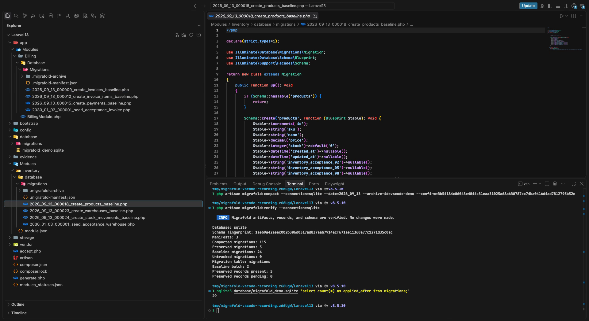

# Migrafold

Migrafold folds Laravel migration history into verified, deploy-safe baseline migrations.

> Migrafold uses tag-driven releases. Git tags are the single source of truth for published package versions, so `composer.json` intentionally does not declare a version.

## Product boundary

Migrafold is designed to produce readable, per-table PHP baseline migrations while preserving safety around existing databases, migration records, archived source files, and Module ownership.

Supported scope:

- PHP 8.2 or newer.
- Laravel 12 and 13.
- SQLite, MySQL, MariaDB, and PostgreSQL with same-engine verification.
- Plain Laravel, Moduark, and nWidart Module discovery.
- Archive by default; explicit confirmation for deletion.
- Manifest-scoped migration-record activation instead of truncating the repository.

## Watch the compaction

[](https://github.com/cluion/migrafold/releases/download/v0.2.0/migrafold-v0.2.0-vscode-demo.mp4)

The [v0.2.0 VS Code demo](https://github.com/cluion/migrafold/releases/download/v0.2.0/migrafold-v0.2.0-vscode-demo.mp4) uses a disposable Laravel 13 application with SQLite and migrations owned by the application, Moduark, and nWidart. Its 120 applied migrations become 24 readable baselines plus 5 preserved data migrations. Migrafold archives 115 retired source files, replaces their migration records so the record count changes from 120 to 29, and `migrafold:verify` passes. This is a tested example, not a promise that every migration history can be compacted.

## Capabilities

Migrafold provides:

- Framework-lifecycle fixtures for Laravel's pending-list, migration-log, existing-table guard, and fail-closed rollback behavior.
- A read-only SQLite schema inspector for columns, defaults, collations, generated columns, indexes, and foreign keys.
- A read-only MySQL/MariaDB inspector with real-server coverage and fail-closed detection for schema details that are not yet representable.
- A read-only PostgreSQL inspector with PostgreSQL 16/17 coverage, lossless Blueprint mapping, and fail-closed detection for unsupported schemas.
- Canonical, deterministic JSON snapshots with SHA-256 fingerprints and an explicit capability report.
- A deterministic per-table PHP migration generator with dependency ordering, existing-table guards, and irreversible rollback protection.
- A dry-run-first output writer with collision refusal, verified file publication, and deterministic manifests.
- Deterministic migration discovery for Laravel applications, active Moduark Modules, and active nWidart Modules, including explicit table ownership and source fingerprints.
- Owner-aware output planning with per-owner manifests, global dry-run preflight, and rollback across application and Module directories.
- Manifest-protected source archival or explicit deletion with fingerprint revalidation and cross-owner rollback.
- Transactional, lock-protected migration-record activation that replaces only the exact retired scope and preserves unrelated history.
- An end-to-end `migrafold:plan` command with human-readable and JSON output, automatic Moduark runtime discovery, and no filesystem or migration-record writes.
- A recoverable execution coordinator that retains private source checkpoints until record activation commits and compensates filesystem changes on failure.
- An explicitly confirmed `migrafold:compact` command with whole-plan fingerprint binding and a second confirmation for permanent deletion.
- Catalog-wide AST classification that compacts schema-only migrations, preserves data-only migrations, and blocks mixed, raw, dynamic, unsupported, or invalid migrations.
- SQLite, MySQL, MariaDB, and PostgreSQL source/baseline replay in separate temporary databases, including current-database fingerprint verification and baseline-before-preserved ordering checks.
- Exact compacted scope propagation: preserved migrations remain in place and their migration records are not retired.
- Planner-generated v2 manifests that record the global compacted/preserved migration scope and same-engine replay fingerprints without database credentials or temporary sandbox identities.
- A read-only `migrafold:verify` command for detecting manifest, migration file, migration record, and current-schema drift after compaction.
- Fail-closed detection for schema features that cannot yet be represented safely.

## What happens to an existing migration history?

Migrafold generates one readable PHP baseline per final database table, not one file per original migration. For example, if a project has 230 applied migrations, of which 200 are supported schema-only changes and 30 are data-only changes, and its final schema has 45 tables, a successful compaction would leave 45 baselines plus the 30 preserved data migrations active. The 200 schema migrations would be archived by default, and their 200 rows in the `migrations` table would be replaced with 45 baseline rows. Unrelated records remain untouched. These numbers are an illustration, not a promise for every project: unsupported, mixed schema/data, dynamic, or drifted histories fail closed.

Application baselines remain under `database/migrations`; active Moduark and nWidart Module baselines remain in their respective Module migration directories. Each owner also receives a `.migrafold-manifest.json` audit file. Archived sources stay under that owner's `.migrafold-archive/<archive-id>/` directory; data-only migrations stay active. Back up the database and source history and rehearse the complete file-and-record cutover on an isolated copy before considering a production run. MySQL, MariaDB, and PostgreSQL planning require permissions to create and remove isolated replay databases on the selected server.

On an existing database, compaction changes the selected migration records but does not rerun the new baselines or rebuild the business tables. On a fresh database, the application and active Module migration paths must be run to create the final tables before preserved data migrations. The `Schema::hasTable()` guard only skips creation when a table already exists; it is not a substitute for migration-record activation or schema verification. Run `migrafold:verify` after compaction and before treating the result as accepted.

Generated baselines intentionally throw `MGF-ROLLBACK-001` from `down()` rather than dropping a populated table. `migrate:rollback`, `migrate:reset`, and `migrate:refresh` cannot automatically reverse a baseline. `migrate:fresh` wipes the database and then runs active migrations; use it only on disposable databases. Recovering an existing database requires an explicit, backed-up restoration procedure, not simply moving archived PHP files back.

## Preview a compaction

```bash
php artisan migrafold:plan \
    --date=2026_09_12 \
    --archive-id=2026-09-12T120000Z
```

Use `--json` for machine-readable output or `--delete` to preview permanent source deletion. The command replays source and generated migrations in task-specific temporary databases, then removes them. It does not change the selected database, move or delete source files, publish baselines, or activate migration records.

SQLite sandboxes are local temporary files. MySQL, MariaDB, and PostgreSQL sandboxes are separate databases on the selected server, created with a fixed `migrafold_replay_` prefix and random identity. Cleanup requires the expected name, token, server identity, and database-resident ownership marker to match. The selected database account must be allowed to create and drop databases. PostgreSQL replay additionally requires an exact `public` search path and access to the server identity returned by `pg_control_system()`. Cross-database or cross-schema foreign keys, active source transactions, and non-empty table prefixes fail closed.

The plan output includes a fingerprint covering the schema, source fingerprints, migration classifications and actions, owner paths, generated outputs, source disposition, migration table, and record replacement scope. Data-only migrations are reported under `analysis.preserve`; their row data is replayed for execution safety but is not compared for equality.

Every application or Module directory receiving baselines also receives a `migrafold-manifest-v2` file. It records the globally verified compacted and preserved migration entries, their source fingerprints and owners, source/baseline/current schema fingerprints, migration counts, and the same-engine replay mode. Temporary database names, server addresses, and credentials are not persisted.

## Execute a compaction

Run the planning command first with an explicit date and archive identifier, review its complete scope, then pass the reported fingerprint to the execution command:

```bash
php artisan migrafold:compact \
    --date=2026_09_12 \
    --archive-id=2026-09-12T120000Z \
    --confirm=<plan-fingerprint>
```

Without `--confirm`, an interactive terminal asks for the exact fingerprint. Non-interactive execution requires the option. If the database schema, migration source contents, ownership, output paths, archive destination, or record scope changes after planning, the fingerprint no longer matches and execution stops without mutation.

Permanent deletion requires the same fingerprint twice:

```bash
php artisan migrafold:compact \
    --date=2026_09_12 \
    --delete \
    --confirm=<plan-fingerprint> \
    --confirm-delete=<plan-fingerprint>
```

Archive mode remains the default. The execution command has no general force bypass.

## Verify an installed compaction

After compaction, verify the published state without creating sandboxes or changing files and database records:

```bash
php artisan migrafold:verify
```

Use `--connection=<name>` to select a database connection or `--json` for machine-readable output. Verification requires every discovered v2 owner manifest to share the same global audit scope, checks baseline and preserved file fingerprints, confirms that compacted sources and records are gone, and requires every baseline record to exist exactly once in one batch. A preserved migration record may be present or pending, but duplicates fail closed.

The current database driver and schema fingerprint must still match the manifest. Migrations added after compaction are reported as untracked; schema changes made by them are reported as drift. Only currently active Laravel, Moduark, and nWidart owners are discovered, so manifests belonging exclusively to inactive Modules are outside the command's verified scope.

When all three Moduark runtime services are available, active Module migration directories and table ownership are included automatically. A partial Moduark runtime fails closed instead of silently producing an incomplete plan.

When `nwidart/laravel-modules` is active, Migrafold uses its repository's enabled Module list and configured migration generator path. Because nWidart does not expose authoritative table ownership, configure every Module table explicitly:

```php
// config/migrafold.php
return [
    'nwidart' => [
        'table_owners' => [
            'invoices' => 'Billing',
            'invoice_items' => 'Billing',
        ],
    ],
];
```

Publish the configuration with `php artisan vendor:publish --tag=migrafold-config`. An inactive or unknown owner, unsafe Module path, vendor-owned Module, unsafe generator path, or Module migration history without explicit ownership stops planning before any mutation.

## Schema generation support

Migrafold renders the inspected physical schema rather than trying to recover the original Laravel helper calls. The verified column mapping covers:

- Signed and unsigned integer families, booleans, and safe auto-increment primary keys.
- `char`, `varchar`, text families, and JSON.
- Date, datetime, timestamp, time, and year columns with available precision.
- Decimal, SQLite numeric, float, and double columns, including MySQL/MariaDB unsigned modifiers and PostgreSQL `real`/`double precision` defaults.
- PostgreSQL `bytea`, `jsonb`, signed serial columns, and timestamp/time columns with time zone.
- Enum, set, blob, fixed binary, and variable binary columns.
- Nullable values, raw defaults, collations, comments, and virtual or stored generated expressions where the database exposes them.

Types or modifiers without a lossless Blueprint representation stop generation with `MGF-GENERATE-001`. Examples include bit fields, precision-bearing SQLite numeric declarations, ambiguous SQLite `real` columns, nonstandard blob sizes, and spatial columns. Existing inspector-level safety checks still reject schema features such as triggers, check constraints, expression indexes, and partial or prefix indexes before rendering.

## Development

```bash
composer install
composer test
composer test:consumer
composer analyse
composer test:databases
composer test:moduark
composer test:nwidart
```

The default tests use an in-memory SQLite database. Database integration tests start isolated MySQL 8.0, MariaDB 11.8, PostgreSQL 16, and PostgreSQL 17 containers, accept only dedicated `*_testing` databases, and remove their containers and storage after the run.

Consumer acceptance exports the current Git commit, installs a non-symlinked package copy into isolated Laravel 12 and 13 applications, and verifies automatic package discovery, planning, archive and delete compaction, exact migration-record activation, fresh baseline replay, and installed-state verification before and after replay. The real-database harness runs MySQL, MariaDB, PostgreSQL 16, and PostgreSQL 17; PostgreSQL archive and delete flows are both exercised. Verification must leave baseline and manifest fingerprints and migration records unchanged. Development-only files and local uncommitted changes are excluded from the package under test.

The Moduark interoperability tests install isolated matching-major dependency sets for Laravel 12 and 13 with the current stable Moduark 1.x release. Each harness exercises the official registry, resource manifest, and table ownership runtime through baseline publication, source archival, and migration-record activation.

The nWidart interoperability tests install isolated matching-major dependency sets for Laravel 12 with nWidart 12 and Laravel 13 with nWidart 13. Each harness uses its own dedicated SQLite `*_testing` database and exercises official runtime discovery through baseline publication, source archival, and migration-record activation.

Continuous integration runs the core test and static-analysis suite against Laravel 12 on PHP 8.2 and Laravel 13 on PHP 8.3. Separate jobs run both interoperability harnesses across their matching Laravel majors. A path-filtered database workflow runs the same matching-major matrix against disposable MySQL 8.0, MariaDB 11.8, PostgreSQL 16, and PostgreSQL 17 containers, including PostgreSQL archive and delete consumer acceptance.

## Release information

See [CHANGELOG.md](CHANGELOG.md) for release contents and [RELEASING.md](RELEASING.md) for the required verification and publication checklist. A release is not considered published until its fixed commit passes hosted CI, the annotated tag and GitHub release exist, and the package is installable through Packagist.
